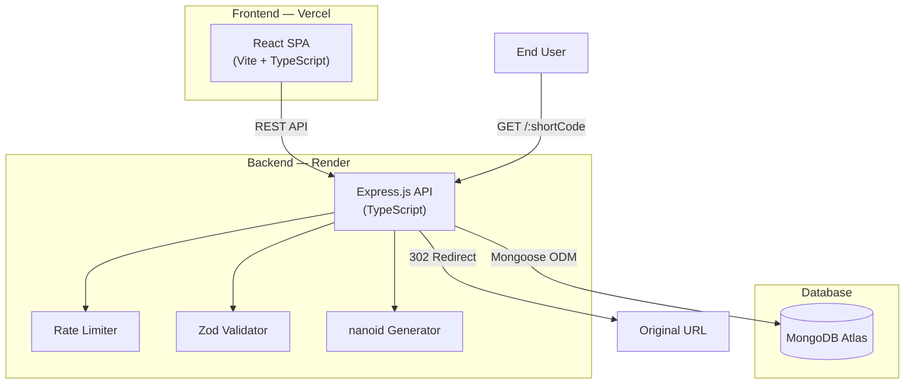
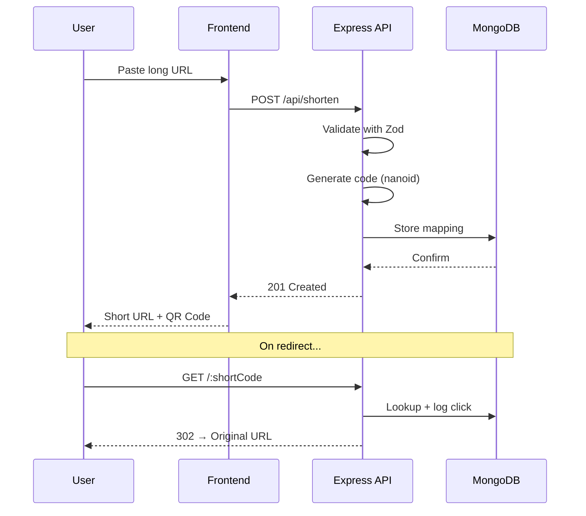

<div align="center">

# ⚡ Snip — URL Shortener

**Shorten. Share. Track.**

A production-grade URL shortener with a RESTful API, real-time click analytics, and a stunning dark-mode dashboard.

[](https://github.com/dupgen10/url-shortener/actions/workflows/ci.yml)
[](LICENSE)
[](https://www.typescriptlang.org/)
[](https://nodejs.org/)
[](https://www.mongodb.com/)
[](https://react.dev/)

🌐 **[Live Demo → snip-url.vercel.app](https://snip-url.vercel.app)** · [API Docs](#-api-documentation) · [Getting Started](#-getting-started) · [Architecture](#-architecture)

</div>

---

## 📸 Screenshots

<!-- TODO: Add screenshots after deployment -->
<!--  -->
<!--  -->

---

## ✨ Features

| Feature | Description |
|---------|-------------|
| 🔗 **URL Shortening** | Convert long URLs into compact, shareable short links |
| 📊 **Click Analytics** | Track total clicks, devices, browsers, and referrer sources |
| 📱 **QR Code Generation** | Generate downloadable QR codes for every short URL |
| 📋 **One-Click Copy** | Copy short URLs to clipboard instantly |
| 🛡️ **Rate Limiting** | API protection with 100 req/15 min per IP |
| ✅ **Input Validation** | Robust URL validation using Zod schemas |
| 🔒 **Security Hardened** | Helmet.js for secure HTTP headers |
| 🌙 **Dark Mode UI** | Stunning glassmorphism dashboard with gradient accents |
| 📱 **Responsive** | Mobile-first design that works on all devices |
| ⚡ **Fast Redirects** | Sub-100ms redirects with MongoDB indexed lookups |

---

## 🏗️ Architecture



### Request Flow



---

## 🛠️ Tech Stack

| Layer | Technology | Purpose |
|-------|-----------|---------|
| **Runtime** | Node.js 20 | JavaScript runtime |
| **Language** | TypeScript 5 | Type safety |
| **Backend** | Express.js | REST API framework |
| **Database** | MongoDB + Mongoose | Document storage + ODM |
| **Frontend** | React 19 + Vite | UI framework + build tool |
| **Validation** | Zod | Schema validation |
| **Short IDs** | nanoid | Collision-resistant ID generation |
| **Security** | Helmet, CORS, Rate Limit | HTTP hardening |
| **Analytics** | ua-parser-js | User-agent parsing |
| **QR Codes** | qrcode.react | QR code generation |
| **Testing** | Jest + Supertest | Backend API tests |
| **CI/CD** | GitHub Actions | Automated testing |

---

## 📡 API Documentation

Base URL: `https://url-shortener-9a0j.onrender.com`

### Endpoints

#### Create Short URL
```http
POST /api/shorten
Content-Type: application/json

{
  "url": "https://www.example.com/some/very/long/url"
}
```
**Response** `201 Created`
```json
{
  "_id": "507f1f77bcf86cd799439011",
  "url": "https://www.example.com/some/very/long/url",
  "shortCode": "aB3x7Kp",
  "accessCount": 0,
  "createdAt": "2025-01-15T12:00:00.000Z",
  "updatedAt": "2025-01-15T12:00:00.000Z"
}
```

#### Retrieve URL
```http
GET /api/shorten/:shortCode
```
**Response** `200 OK` — Returns URL details (same schema as above)

#### Update URL
```http
PUT /api/shorten/:shortCode
Content-Type: application/json

{
  "url": "https://www.example.com/updated/url"
}
```
**Response** `200 OK` — Returns updated URL details

#### Delete URL
```http
DELETE /api/shorten/:shortCode
```
**Response** `204 No Content`

#### Get Statistics
```http
GET /api/shorten/:shortCode/stats
```
**Response** `200 OK`
```json
{
  "_id": "507f1f77bcf86cd799439011",
  "url": "https://www.example.com/some/long/url",
  "shortCode": "aB3x7Kp",
  "accessCount": 42,
  "createdAt": "2025-01-15T12:00:00.000Z",
  "updatedAt": "2025-01-15T12:30:00.000Z",
  "clicks": [
    {
      "timestamp": "2025-01-15T14:30:00.000Z",
      "device": "Mobile",
      "browser": "Chrome",
      "referrer": "https://twitter.com"
    }
  ]
}
```

#### Redirect
```http
GET /:shortCode
```
**Response** `302 Found` — Redirects to original URL

### Error Responses
| Status | Meaning |
|--------|---------|
| `400` | Invalid request body / URL format |
| `404` | Short code not found |
| `429` | Rate limit exceeded |
| `500` | Internal server error |

---

## 🚀 Getting Started

### Prerequisites
- [Node.js](https://nodejs.org/) v18+
- [MongoDB](https://www.mongodb.com/) (local or Atlas)
- [Git](https://git-scm.com/)

### 1. Clone the repository
```bash
git clone https://github.com/dupgen10/url-shortener.git
cd url-shortener
```

### 2. Setup the backend
```bash
cd server
npm install
```

Create a `.env` file:
```bash
cp .env.example .env
```

Edit `.env` with your MongoDB connection string:
```env
MONGO_URI=mongodb://localhost:27017/urlshortener
PORT=3001
CLIENT_URL=http://localhost:5173
NODE_ENV=development
```

Start the backend:
```bash
npm run dev
```

### 3. Setup the frontend
Open a new terminal:
```bash
cd client
npm install
```

Create a `.env` file:
```env
VITE_API_URL=http://localhost:3001
```

Start the frontend:
```bash
npm run dev
```

### 4. Open the app
Visit [http://localhost:5173](http://localhost:5173) 🎉

---

## 🧪 Running Tests

```bash
# Backend tests (Jest + Supertest)
cd server
npm test

# TypeScript type check
npx tsc --noEmit
```

**Test Results:** 16/16 tests passing ✅

---

## 📁 Project Structure

```
url-shortener/
├── server/                          # Express.js backend
│   ├── src/
│   │   ├── config/db.ts             # MongoDB connection
│   │   ├── models/
│   │   │   ├── Url.ts               # URL document schema
│   │   │   └── Click.ts             # Click analytics schema
│   │   ├── routes/
│   │   │   ├── shorten.ts           # CRUD API routes
│   │   │   └── redirect.ts          # Redirect route
│   │   ├── controllers/
│   │   │   ├── shortenController.ts  # API handlers
│   │   │   └── redirectController.ts # Redirect handler
│   │   ├── services/
│   │   │   ├── urlService.ts         # URL business logic
│   │   │   └── analyticsService.ts   # Click tracking
│   │   ├── middleware/
│   │   │   ├── rateLimiter.ts        # Rate limiting
│   │   │   ├── errorHandler.ts       # Error handling
│   │   │   └── validateRequest.ts    # Zod validation
│   │   ├── utils/
│   │   │   └── generateCode.ts       # Short code generator
│   │   ├── app.ts                    # Express app config
│   │   └── server.ts                 # Entry point
│   └── tests/
│       ├── shorten.test.ts           # API endpoint tests
│       └── redirect.test.ts          # Redirect tests
│
├── client/                           # React frontend
│   ├── src/
│   │   ├── components/
│   │   │   ├── Hero.tsx              # URL input section
│   │   │   ├── UrlCard.tsx           # Short URL card
│   │   │   ├── UrlList.tsx           # URL cards grid
│   │   │   ├── StatsModal.tsx        # Analytics modal
│   │   │   ├── QRCodeModal.tsx       # QR code display
│   │   │   ├── CopyButton.tsx        # Copy to clipboard
│   │   │   └── Layout.tsx            # App shell
│   │   ├── services/api.ts           # API client
│   │   ├── types/index.ts            # TypeScript types
│   │   ├── App.tsx                   # Main app
│   │   └── index.css                 # Design system
│   └── index.html
│
├── .github/workflows/ci.yml          # CI pipeline
├── .env.example                      # Environment template
├── .gitignore
├── LICENSE                            # MIT
└── README.md                          # You are here
```

---

## 🌐 Deployment

### Backend → [Render](https://render.com)
1. Create a new **Web Service** on Render
2. Connect your GitHub repository
3. **Build Command:** `cd server && npm install && npm run build`
4. **Start Command:** `cd server && npm start`
5. Add environment variables: `MONGO_URI`, `CLIENT_URL`, `PORT`

### Database → [MongoDB Atlas](https://www.mongodb.com/atlas)
1. Create a free **M0** cluster
2. Whitelist IP `0.0.0.0/0`
3. Create a database user and get the connection string

### Frontend → [Vercel](https://vercel.com)
1. Import your GitHub repository
2. Set root directory to `client`
3. Add `VITE_API_URL` pointing to your Render backend URL

---

## 💡 Design Decisions

| Decision | Choice | Rationale |
|----------|--------|-----------|
| **Short code generation** | nanoid (7 chars) | ~3.5 trillion combinations, URL-safe, no counter needed |
| **Database** | MongoDB | Flexible schema for analytics, great free tier (Atlas) |
| **Redirect type** | 302 (Found) | Allows analytics tracking; 301 would be cached by browsers |
| **Architecture** | Monorepo | Simpler to manage for a portfolio project |
| **Analytics recording** | Fire-and-forget | Non-blocking redirects — click logging is async |
| **Validation** | Zod | Type-safe schemas with excellent TypeScript inference |

---

## 🗺️ Future Improvements

- [ ] Custom aliases (vanity URLs)
- [ ] User authentication (JWT)
- [ ] Link expiration dates
- [ ] Bulk URL shortening
- [ ] Click analytics charts (Chart.js)
- [ ] Redis caching for hot URLs
- [ ] Geographic tracking (IP geolocation)
- [ ] Browser extension
- [ ] API key authentication

---

## 📝 License

This project is licensed under the MIT License — see the [LICENSE](LICENSE) file for details.

---

## 👤 Author

Built with ❤️ as a portfolio project.

<!-- Replace with your details -->
<!-- - [Portfolio](https://yourportfolio.com) -->
<!-- - [LinkedIn](https://linkedin.com/in/yourusername) -->
<!-- - [GitHub](https://github.com/yourusername) -->

---

<div align="center">

**⭐ Star this repo if you found it useful!**

</div>
